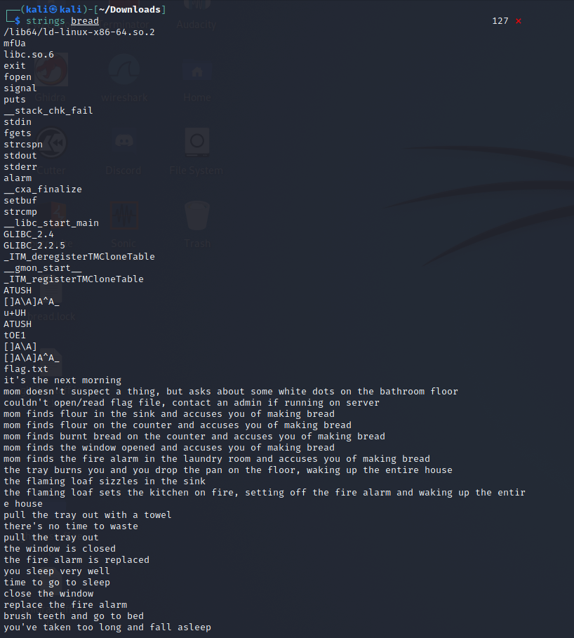
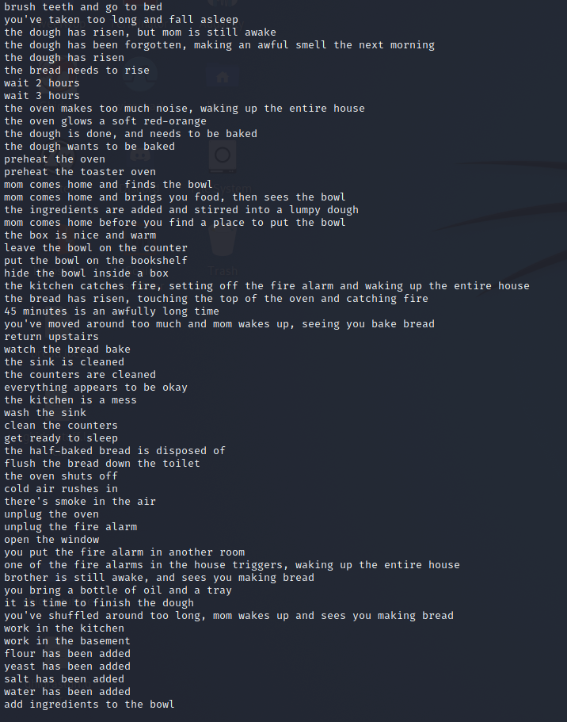
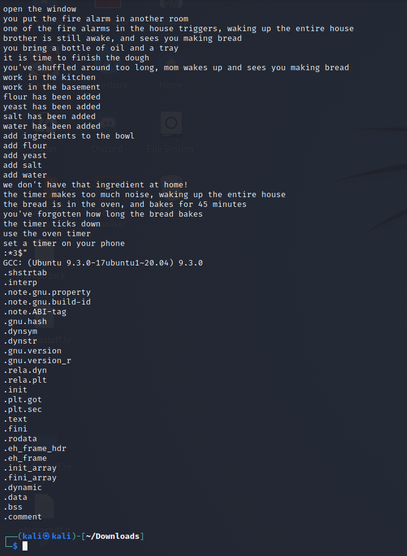

# Reverse Engineering: bread-making
***worth 108 points***

**category: rev**

**description:**


**attached files:** *[bread](https://static.redpwn.net/uploads/9eee9f077b941e88e1fe75d404582d4f286d9c74729f3ad0d1bb44a527579af8/bread)* 

(This is my first time doing Redpwn and the first problem I tried to solve. Stuff written in parentheses are rookie mistakes or things that I learned as a rookie, that way people can learn from my mistakes and I can too.)

So, this problem is reverse engineering. It's time to look at the code in the file.

The file's extension isn't shown, but can be run on linux.

They have also given us `nc mc.ax 31796` (later on my team told me it was netcat, which is a tool to connect to servers, and pasting the command into terminal can connect you to Redpwn's server)

# My Solution

(I overthought this problem too much and spent around 3+ hours on this problem. Do not overthink problems, it's a bad habit of mine)

The first thing I did was not put it into Ghidra, but open it in notepad++.(Which is *definitely* the best thing to do for reverse engineering problems) Somehow, I got lucky and saw text in the file. Dual-booting into Ubuntu, I downloaded the file and used Strings on the file. (Later on, I would use a Kali-Linux virtual machine which is much easier)

The output of the strings'd file:
#### first page

#### second page

#### third page


So we have a bunch of text, what does it all mean?

(I decided that it was probably some really hard problem, and I decided to use a reverse engineering program and my team told me to use Ghidra)
(I looked at the file with Ghidra for around 3/4 of the time mentioned above, and it didn't help me)
(I found the same text)

So, I decided to backtrack and look at the text which I strings'd out.

```
/lib64/ld-linux-x86-64.so.2
mfUa
libc.so.6
exit
fopen
signal
puts
__stack_chk_fail
stdin
fgets
strcspn
stdout
stderr
alarm
__cxa_finalize
setbuf
strcmp
__libc_start_main
GLIBC_2.4
GLIBC_2.2.5
_ITM_deregisterTMCloneTable
__gmon_start__
_ITM_registerTMCloneTable
ATUSH
[]A\A]A^A_
u+UH
ATUSH
tOE1
[]A\A]
[]A\A]A^A_
flag.txt
it's the next morning
mom doesn't suspect a thing, but asks about some white dots on the bathroom floor
couldn't open/read flag file, contact an admin if running on server
mom finds flour in the sink and accuses you of making bread
mom finds flour on the counter and accuses you of making bread
mom finds burnt bread on the counter and accuses you of making bread
mom finds the window opened and accuses you of making bread
mom finds the fire alarm in the laundry room and accuses you of making bread
the tray burns you and you drop the pan on the floor, waking up the entire house
the flaming loaf sizzles in the sink
the flaming loaf sets the kitchen on fire, setting off the fire alarm and waking up the entire house
pull the tray out with a towel
there's no time to waste
pull the tray out
the window is closed
the fire alarm is replaced
you sleep very well
time to go to sleep
close the window
replace the fire alarm
brush teeth and go to bed
you've taken too long and fall asleep
the dough has risen, but mom is still awake
the dough has been forgotten, making an awful smell the next morning
the dough has risen
the bread needs to rise
wait 2 hours
wait 3 hours
the oven makes too much noise, waking up the entire house
the oven glows a soft red-orange
the dough is done, and needs to be baked
the dough wants to be baked
preheat the oven
preheat the toaster oven
mom comes home and finds the bowl
mom comes home and brings you food, then sees the bowl
the ingredients are added and stirred into a lumpy dough
mom comes home before you find a place to put the bowl
the box is nice and warm
leave the bowl on the counter
put the bowl on the bookshelf
hide the bowl inside a box
the kitchen catches fire, setting off the fire alarm and waking up the entire house
the bread has risen, touching the top of the oven and catching fire
45 minutes is an awfully long time
you've moved around too much and mom wakes up, seeing you bake bread
return upstairs
watch the bread bake
the sink is cleaned
the counters are cleaned
everything appears to be okay
the kitchen is a mess
wash the sink
clean the counters
get ready to sleep
the half-baked bread is disposed of
flush the bread down the toilet
the oven shuts off
cold air rushes in
there's smoke in the air
unplug the oven
unplug the fire alarm
open the window
you put the fire alarm in another room
one of the fire alarms in the house triggers, waking up the entire house
brother is still awake, and sees you making bread
you bring a bottle of oil and a tray
it is time to finish the dough
you've shuffled around too long, mom wakes up and sees you making bread
work in the kitchen
work in the basement
flour has been added
yeast has been added
salt has been added
water has been added
add ingredients to the bowl
add flour
add yeast
add salt
add water
we don't have that ingredient at home!
the timer makes too much noise, waking up the entire house
the bread is in the oven, and bakes for 45 minutes
you've forgotten how long the bread bakes
the timer ticks down
use the oven timer
set a timer on your phone
:*3$"
GCC: (Ubuntu 9.3.0-17ubuntu1~20.04) 9.3.0
.shstrtab
.interp
.note.gnu.property
.note.gnu.build-id
.note.ABI-tag
.gnu.hash
.dynsym
.dynstr
.gnu.version
.gnu.version_r
.rela.dyn
.rela.plt
.init
.plt.got
.plt.sec
.text
.fini
.rodata
.eh_frame_hdr
.eh_frame
.init_array
.fini_array
.dynamic
.data
.bss
.comment
```
I decided to ignore everything that looked like something that helped the file run and wasn't something that seemed like a certain instruction or situation while making bread.  I copied all of the instructions or situations.
This is what I got:
```
it's the next morning
mom doesn't suspect a thing, but asks about some white dots on the bathroom floor
couldn't open/read flag file, contact an admin if running on server
mom finds flour in the sink and accuses you of making bread
mom finds flour on the counter and accuses you of making bread
mom finds burnt bread on the counter and accuses you of making bread
mom finds the window opened and accuses you of making bread
mom finds the fire alarm in the laundry room and accuses you of making bread
the tray burns you and you drop the pan on the floor, waking up the entire house
the flaming loaf sizzles in the sink
the flaming loaf sets the kitchen on fire, setting off the fire alarm and waking up the entire house
pull the tray out with a towel
there's no time to waste
pull the tray out
the window is closed
the fire alarm is replaced
you sleep very well
time to go to sleep
close the window
replace the fire alarm
brush teeth and go to bed
you've taken too long and fall asleep
the dough has risen, but mom is still awake
the dough has been forgotten, making an awful smell the next morning
the dough has risen
the bread needs to rise
wait 2 hours
wait 3 hours
the oven makes too much noise, waking up the entire house
the oven glows a soft red-orange
the dough is done, and needs to be baked
the dough wants to be baked
preheat the oven
preheat the toaster oven
mom comes home and finds the bowl
mom comes home and brings you food, then sees the bowl
the ingredients are added and stirred into a lumpy dough
mom comes home before you find a place to put the bowl
the box is nice and warm
leave the bowl on the counter
put the bowl on the bookshelf
hide the bowl inside a box
the kitchen catches fire, setting off the fire alarm and waking up the entire house
the bread has risen, touching the top of the oven and catching fire
45 minutes is an awfully long time
you've moved around too much and mom wakes up, seeing you bake bread
return upstairs
watch the bread bake
the sink is cleaned
the counters are cleaned
everything appears to be okay
the kitchen is a mess
wash the sink
clean the counters
get ready to sleep
the half-baked bread is disposed of
flush the bread down the toilet
the oven shuts off
cold air rushes in
there's smoke in the air
unplug the oven
unplug the fire alarm
open the window
you put the fire alarm in another room
one of the fire alarms in the house triggers, waking up the entire house
brother is still awake, and sees you making bread
you bring a bottle of oil and a tray
it is time to finish the dough
you've shuffled around too long, mom wakes up and sees you making bread
work in the kitchen
work in the basement
flour has been added
yeast has been added
salt has been added
water has been added
add ingredients to the bowl
add flour
add yeast
add salt
add water
we don't have that ingredient at home!
the timer makes too much noise, waking up the entire house
the bread is in the oven, and bakes for 45 minutes
you've forgotten how long the bread bakes
the timer ticks down
use the oven timer
set a timer on your phone
```

