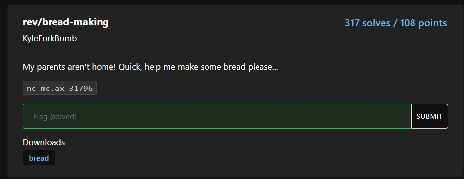

# Reverse Engineering: bread-making
(worth 108 points)

**category: rev**

**description:**

**attached files:** *[bread](https://static.redpwn.net/uploads/9eee9f077b941e88e1fe75d404582d4f286d9c74729f3ad0d1bb44a527579af8/bread)* 

(This is my first time doing Redpwn and the first problem I tried to solve)

So, this problem is reverse engineering. It's time to look at the code in the file.

They have also given us something called nc
